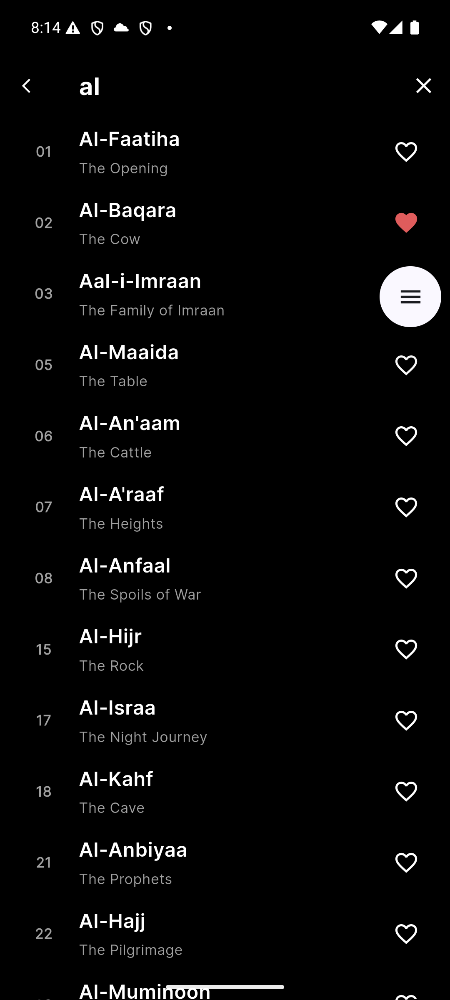
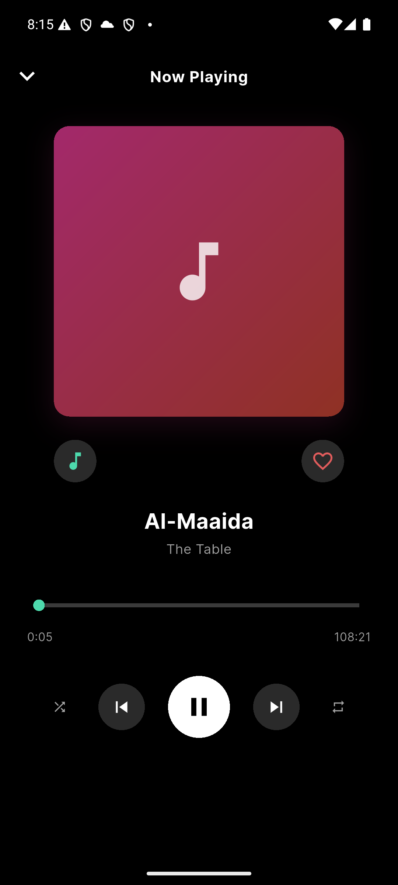

# Music Player

---

## Logo


---

## Features

- **Browse Songs**: View a curated catalogue of tracks with beautiful gradients generated dynamically based on song IDs.
- **Instant Search**: Search through the entire catalog in real-time by song title or artist name.
- **Audio Player**: Now Playing dashboard supporting play/pause, precise seeking/scrubbing, skip previous/next, shuffle, and repeat modes.
- **Favorites**: Save your favorite songs locally.
- **Recently Played**: Track and display your recently played songs on the main dashboard for quick access.

---

## Screenshots

| Home Screen | Browse Screen | Now Playing |
| :---: | :---: | :---: |
|  |  |  |

---

## Tech Stack & Packages Used

| Technology | Purpose | Key Benefit |
| :--- | :--- | :--- |
| **Flutter** | Core Framework | High-performance, declarative multi-platform UI with curated dark theme styling. |
| **BLoC** | State Management | Predictable state container with clear separation of events and states for testability. |
| **just_audio** | Audio Engine | Low-latency playback engine with support for gapless multi-source streams. |
| **Dio** | Networking | Feature-rich HTTP client with robust handling of API requests and responses. |
| **go_router** | Navigation | Declarative, type-safe path-based routing supporting seamless transition flows. |
| **get_it** | Dependency Injection | Ultra-lightweight service locator for clean access to repositories, use cases, and services. |
| **shared_preferences** | Local Persistence | Lightweight key-value offline storage for persistent favorites and recently played cache. |

---

## Architecture

This application strictly follows **Clean Architecture** combined with **Domain-Driven Design (DDD)** principles to separate concerns, make the codebase highly testable, and keep code changes isolated.

```
                  ┌──────────────────────────────┐
                  │      Presentation Layer      │
                  │   (UI Widgets & BLoC State)   │
                  └──────────────┬───────────────┘
                                 │
                                 ▼
                  ┌──────────────────────────────┐
                  │         Domain Layer         │
                  │   (Entities & Use Cases)     │
                  └──────────────▲───────────────┘
                                 │
                                 │  Implements Repo Interface
                                 │
                  ┌──────────────┴───────────────┐
                  │          Data Layer          │
                  │   (Models & Data Sources)    │
                  └──────────────────────────────┘
```

### Layer Breakdown

1. **Domain Layer (Core)**: 
   - **Entities**: Business models (e.g., `Song`, `SongDetail`, `AudioTrack`) representing core concepts. Unrelated to any database or API structures.
   - **Use Cases**: Encapsulates specific business rules (e.g., `GetSongListUseCase`, `GetSongDetailUseCase`).
   - **Repositories (Interfaces)**: Defines contracts for data retrieval, keeping the domain isolated from external dependencies.

2. **Data Layer**:
   - **Models**: Extends entities to support JSON deserialisation (`SongModel`, `SongDetailModel`, `AudioTrackModel`).
   - **Data Sources**: Handles low-level network calls using `DioClient` (`SongRemoteDataSource`).
   - **Repositories (Implementation)**: Implements the domain contracts, deciding whether to fetch from local cache or remote API.

3. **Presentation Layer**:
   - **BLoCs**: Orchestrates UI events into states using streams (e.g., `PlayerBloc`, `SongBloc`).
   - **UI Widgets & Screens**: Highly interactive, responsive screens built using predefined design tokens (`BrowseScreen`, `HomeScreen`, `NowPlayingScreen`).

---

## Project Structure

Below is an overview of the structured clean-architecture folder tree:

```
lib/
├── core/                         # Shared core utilities & cross-cutting concerns
│   ├── audio/                    # just_audio wrapper service
│   ├── constants/                # Curated styling tokens (colors, dimensions, text styles)
│   ├── di/                       # Dependency injection registry (GetIt setup)
│   ├── network/                  # Dio API network client configuration
│   ├── router/                   # GoRouter navigation route configurations
│   ├── theme/                    # High-fidelity dark mode visual themes
│   └── utils/                    # Common helper utilities (e.g. DurationFormatter)
├── data/                         # Concrete data layer implementation
│   ├── datasources/              # Remote API & cache interfaces/implementations
│   ├── models/                   # Serialization-capable models
│   └── repositories/             # Repository implementations (fulfilling domain contracts)
├── domain/                       # Pure enterprise business rules & logic
│   ├── entities/                 # Clean business data contracts
│   ├── repositories/             # Abstract repository definitions
│   └── usecases/                 # Single-purpose business action handlers
└── presentation/                 # User Interface components
    ├── blocs/                    # State managers (Song, Player, Favorites, Recently Played)
    ├── screens/                  # Top-level routable screen layouts
    └── widgets/                  # Modular, reusable visual components (common & player-specific)
```

---

## State Management

The application features highly focused, single-responsibility **BLoCs (Business Logic Components)**:

### 1. `SongBloc`
- **Purpose**: Manages search, filtering, and lazy loading of the remote song catalog.
- **Events**:
  - `SongListRequested`: Fetches the initial catalog.
  - `SongSearchQueryChanged`: Filters catalog dynamically in-memory.
- **States**: `SongInitial`, `SongLoading`, `SongLoaded`, `SongError`.
- **Scope**: Screen-scoped via `BlocProvider` in `BrowseScreen` and `HomeScreen`.

### 2. `PlayerBloc`
- **Purpose**: Manages audio playback, tracking elapsed/total time, and bridging with the `AudioService`.
- **Events**:
  - `PlayerSongRequested`: Plays a song by its unique ID.
  - `PlayerPauseRequested` / `PlayerResumeRequested`: Pauses or resumes audio.
  - `PlayerSeekRequested`: Jumps to a specific elapsed timestamp.
  - `PlayerNextRequested` / `PlayerPreviousRequested`: Advances sequentially (or randomly if shuffle is enabled) or returns to the previous song.
  - `PlayerShuffleToggled` / `PlayerRepeatToggled`: Toggles player mode flags reactively and natively controls playback loop properties.
  - `PlayerPositionUpdated` / `PlayerDurationUpdated`: Updates elapsed and total time.
  - `PlayerPlaybackCompleted`: Internal completion hook that automatically triggers the next song.
- **States**: `PlayerInitial`, `PlayerLoading`, `PlayerActive`, `PlayerError`.
- **Scope**: Globally scoped at root (`main.dart`) to ensure uninterrupted background/screen-to-screen playback.

### 3. `FavoritesBloc`
- **Purpose**: Tracks liked songs, toggles heart icons, and persists preferences to local storage.
- **Events**:
  - `FavoritesLoaded`: Restores favorited IDs from SharedPreferences.
  - `FavoriteToggled`: Adds/removes a song ID and updates disk storage.
- **States**: `FavoritesInitial`, `FavoritesReady`.
- **Scope**: Globally scoped at root (`main.dart`) so toggled states reflect instantly on all UI items.

### 4. `RecentlyPlayedBloc`
- **Purpose**: Captures recently playing songs and persists a history stack (up to 10 unique songs) on disk.
- **Events**:
  - `RecentlyPlayedRestored`: Restores history from SharedPreferences JSON cache on app launch.
  - `RecentlyPlayedSongAdded`: Pushes a recently played song to the front, avoiding duplicates.
- **States**: `RecentlyPlayedInitial`, `RecentlyPlayedReady`.
- **Scope**: Globally scoped at root (`main.dart`).

---

## Seamless Audio Stream Playback

To support playing complex music tracks that consist of consecutive split audio segments (chunks) without silence gaps, the `AudioService` utilizes `just_audio`'s native **`ConcatenatingAudioSource`**:

```dart
final source = ConcatenatingAudioSource(
  children: song.audioTracks
      .map((t) => AudioSource.uri(Uri.parse(t.audioUrl)))
      .toList(),
);
await _player.setAudioSource(source);
```

### Key Advantages:
1. **Zero Silence Gaps**: Audio streams buffer ahead, transitioning to the next track chunk seamlessly.
2. **Unified Seek controls**: The total durations of all sub-tracks are presented to the user as a single, contiguous progress slider.
3. **Optimised Memory**: Chunks are loaded asynchronously, conserving resources on mobile devices.

---

## Setup & Running

Follow these simple steps to set up the project locally:

1. **Clone the Repository**:
   ```bash
   git clone https://github.com/amalyulianto/music-player.git
   cd music-player
   ```

2. **Retrieve Dependencies**:
   ```bash
   flutter pub get
   ```

3. **Launch the Application**:
   - Ensure you have a device or emulator connected:
   ```bash
   flutter run
   ```

---

## Testing

The codebase features robust unit and widget tests maintaining high confidence.

### Run Tests:
```bash
flutter test
```

### Coverage Details:
- **Unit Tests (`test/unit/`)**:
  - `duration_formatter_test.dart`: Validates precise milliseconds-to-string format output.
  - `song_bloc_test.dart`: Tests catalog fetching, query filtering, and failure states.
  - `player_bloc_test.dart`: Mocks the audio player service to verify request/pause/resume/seek state transitions.
  - `favorites_bloc_test.dart`: Verifies that toggling favorites saves to the local storage interface correctly.
- **Widget Tests (`test/widget/`)**:
  - `song_list_item_test.dart`: Asserts correct metadata presentation and interactions with favorite/play actions.
  - `mini_player_bar_test.dart`: Asserts that the floating bar renders the active song layout when playing, with working playback trigger actions.

---